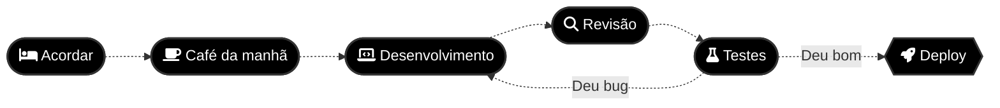

# :man_technologist: Jason Willyan Castro do Nascimento

 

    "If, at first, the idea is not absurd, then there is no hope for it."
    
🐱 About me:

- 🖥️ Software Enginner and QA
- 🐈 Cat lover 
- 🐛 Professional solver
- 💻 Coding enthusiast
- 🌍 Always seeking new challenges
- 🚀 Eager to explore outer space
- 🌟 Hunting for hidden easter eggs
- 🎮 Gamer in my spare time
  
### Languages:

### Frameworks:

  </a>
  </a>
  </a>
  </a>

### Other technologies:

  </a>
  </a>
  </a>
  </a>
  </a>

### Gaming:

  
  
  
  
  

